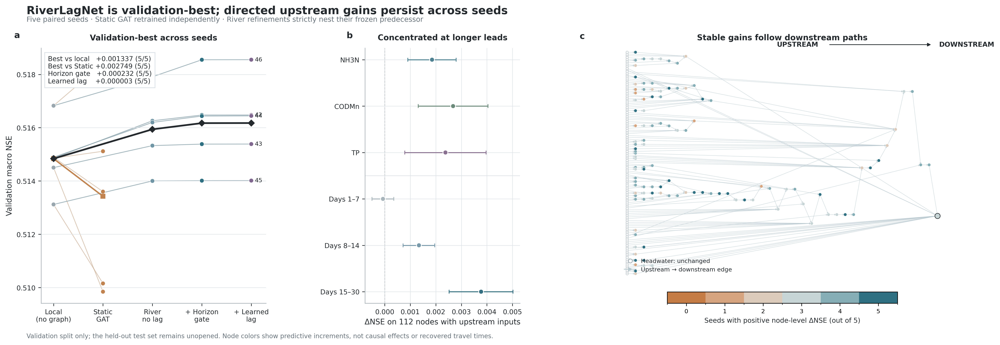
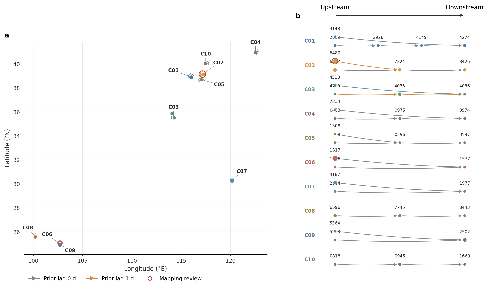

# RiverLagNet v0.1

RiverLagNet is a daily, multi-station water-quality forecasting system centered on **Directed Lag-aware River Message Passing**. It predicts `NH3N`, `CODMn`, and `TP` for the next 30 days from 90 historical days while preserving explicit upstream-to-downstream river direction and discrete travel lags.

The active architecture research adds **Causal Multi-hop Lagged History
Diffusion (CMLHD)**: encoded 27-variable upstream histories are shifted by each
edge's travel-time prior and diffused for multiple directed hops *before* the
node GRU. This solves the post-encoding bottleneck in which local GRUs may
discard transient upstream transport signals before graph interaction. The
operator is past-only and zero-initialized, so residual training starts exactly
from the paired no-graph forecast and keeps headwater predictions unchanged.
See [architecture](docs/architecture.md) for the equations and scope.

The v0.2 candidate `model=river_crossformer` adds two further innovations.
**Edge–Lag–Horizon Sparse Attention (ELHSA)** jointly normalizes upstream edges
and causally observable travel lags for every forecast lead using sparsemax and
a soft travel-time prior. **Transformer–GNN Head Cross Fusion (TGCF)** uses the
local Temporal Transformer state as a query over GNN routing-head tokens, so
graph information is injected conditionally rather than concatenated or added
uniformly. The paired `model.graph_variant=no_graph` condition retains the same
Transformer backbone and training budget.

The next validation candidate, `model=river_crossformer_recurrent`, moves both
innovations into the forecast trajectory. **Recursive Causal Edge-Lag
Attention (RCELA)** uses only observed upstream history or earlier
model-predicted states, jointly normalizes incoming path-lag candidates, and
adapts the travel-time prior with the current Transformer query.
**Graph-Modulated Recurrent Fusion (GMRF)** injects that directed GNN message
inside each future hidden-state transition. It addresses the measured failure
of late graph corrections: even validation-fitted rescaling of the old graph
correction reached only `+3.37%`, so a new state-transition signal basis is
required. The graph projection is zero-started and headwaters stay exactly
local; formal gains must still be established on validation data before any
15% claim is made.

The repository includes deterministic synthetic benchmarks and a leakage-safe real-data path for the China daily monitoring source. Real-data preparation restores per-value imputation flags, excludes imputed values from normalization/loss/metrics, and retains an auditable station-to-river mapping. A single training run is not treated as a general real-world skill claim.

## Environment

Use the existing Conda environment `DeepWater`:

```powershell
conda run -n DeepWater python -m pip install .
conda run -n DeepWater python -m pytest -q
```

Pytest stores temporary files under `build/pytest` and removes them, `.pytest_cache`, and repository-local `__pycache__` directories when the session ends. Test source files are never deleted. Manual smoke outputs can be removed safely with `python -m RiverLagNet.cli.cleanup_test_artifacts`.

On Windows checkouts whose path contains non-ASCII characters, use a regular installation (`pip install .`) rather than editable installation because Python 3.10 may read editable `.pth` files with the system code page.

## Import reusable HydroWQ China assets

The seventh-paper workspace contains hundreds of GiB of raw climate and raster data. RiverLagNet imports only the small processed China multi-basin manifest whitelist (sample NPZ files, river graphs, static attributes, and three audit metadata files):

```powershell
conda run -n DeepWater python -m RiverLagNet.cli.import_hydrowq `
  --source-processed "D:\05.Paper\07.第七篇论文\Code\data\processed" `
  --destination "data\processed\hydrowq-china-multibasin-v0.1"
```

The destination is Git-ignored. Every manifest asset is SHA-256 verified before and after copying; raw rasters, archives, caches, logs, and run outputs are excluded. The imported arrays were already normalized using the source project's training-basin statistics. Do not normalize them again.

These samples have 45 history days and 46 forecast days, so they are intentionally not wired into the default 90-to-30 chronological experiment. `HydroWQChinaCatalog.compatibility()` exposes this mismatch explicitly. See the [import audit](docs/data/hydrowq-china-import-audit-2026-07-13.md) for provenance and quality results.

## Prepare real daily observations

The formal 90-to-30 experiment is prepared from the continuous China source and its per-value imputation flags. It combines the 10 verified monitored river components into one 36-node disjoint graph, aggregates only non-imputed source-station values, and writes ignored local assets under `data/processed/china-real-daily-v0.1`:

```powershell
conda run -n DeepWater python -m RiverLagNet.cli.prepare_real_data `
  --dynamic-path "D:\05.Paper\06.第六篇论文\03.Code\数据填补\output\imputed_water_quality.csv" `
  --flags-path "D:\05.Paper\06.第六篇论文\03.Code\数据填补\output\imputed_water_quality_flags.csv" `
  --mapping-path "D:\05.Paper\07.第七篇论文\Code\data\processed\hydrowq-v0.1\china_bootstrap\station_mapping_hydrorivers.csv" `
  --graph-root "data\processed\hydrowq-china-multibasin-v0.1\hydrowq-v0.1\fixtures\river_graph"
```

The generated manifest contains source and artifact SHA256 values, exact split dates, observation coverage, aggregation semantics, edge direction, and the travel-time prior assumption. See the [real-data audit](docs/data/china-real-daily-audit-2026-07-14.md).

The preferred formal pilot now contracts HydroRIVERS paths across unmonitored reaches instead of retaining only directly adjacent monitored reaches:

```powershell
conda run -n DeepWater python -m RiverLagNet.cli.prepare_contracted_real_data `
  --dynamic-path "D:\05.Paper\06.第六篇论文\03.Code\数据填补\output\imputed_water_quality.csv" `
  --flags-path "D:\05.Paper\06.第六篇论文\03.Code\数据填补\output\imputed_water_quality_flags.csv" `
  --mapping-path "D:\05.Paper\07.第七篇论文\Code\data\processed\hydrowq-v0.1\china_bootstrap\station_mapping_hydrorivers.csv" `
  --hydrorivers-zip "D:\05.Paper\07.第七篇论文\Code\data\raw\hydrosheds\hydrorivers\HydroRIVERS_v10_as_shp.zip"
```

The resulting `china-real-daily-contracted-v0.2` artifact has 238 nodes, 237 directed edges, and complete original-observation coverage for all three targets in the selected component. See the [contracted graph and training audit](docs/data/china-real-daily-contracted-audit-2026-07-14.md).

Run the fixed real-data training configurations with:

```powershell
conda run -n DeepWater python -m RiverLagNet.cli.train data=china_real_daily model=station_gru trainer=formal_gpu experiment=china_real_daily
conda run -n DeepWater python -m RiverLagNet.cli.train data=china_real_daily model=riverlagnet trainer=formal_gpu experiment=china_real_daily
```

For the contracted artifact, replace both overrides with `data=china_real_daily_contracted experiment=china_real_daily_contracted`.

## Contracted real-data attributable graph gain

The current core result uses five paired seeds on the 238-node, 237-edge contracted graph. Each directed model starts from its own validation-selected `no_graph` checkpoint; the local encoder, GRU, and decoder are frozen, upstream output heads start at zero, and only the upstream residual path is trained. The zero-started horizon gate and bounded learned-lag refinement then strictly nest and freeze their selected predecessor. The final candidate improves validation macro NSE over local-only forecasting by `0.001337 ± 0.000412` and over an independently retrained Static Directed GAT by `0.002749 ± 0.002109`; both comparisons are positive for `5/5` seeds. On the 112 nodes that can actually receive upstream messages, the graph-and-horizon gain is `0.002302 ± 0.000711`; all 126 headwater predictions remain bitwise unchanged. Gains are largest at days 15–30 (`+0.003773` macro NSE). The held-out test set remains unopened.



Reproduce the checkpoint-level audit, node table, and PNG/PDF figure with:

```powershell
conda run -n DeepWater python -m RiverLagNet.cli.summarize_graph_gain --device cuda
```

See the [core result](docs/core_result.md), [machine-readable summary](experiments/real_contracted_core_v11_summary.json), and [node-level gains](experiments/real_contracted_core_v11_nodes.csv). The horizon gate adds `0.000232 ± 0.000248` NSE (`5/5` positive). Learned lag adds only `0.00000322 ± 0.00000235`; its peak bias lag is inconsistent across seeds, so stable travel-time recovery is not claimed.

## Train

Full RiverLagNet:

```powershell
conda run -n DeepWater python -m RiverLagNet.cli.train
```

One-batch synthetic validation:

```powershell
conda run -n DeepWater python -m RiverLagNet.cli.train trainer.fast_dev_run=true data=synthetic run_dir=build/smoke/synthetic experiment.record_result=false
conda run -n DeepWater python -m RiverLagNet.cli.cleanup_test_artifacts
```

Station GRU baseline:

```powershell
conda run -n DeepWater python -m RiverLagNet.cli.train model=station_gru
```

Evaluate only a validation-selected checkpoint:

```powershell
conda run -n DeepWater python -m RiverLagNet.cli.evaluate checkpoint_path="runs/.../checkpoints/model.ckpt"
```

Hydra groups are in `configs/data`, `configs/model`, `configs/trainer`, and `configs/experiment`. Trainer precision defaults to `16-mixed` on GPU and automatically falls back to `32-true` on CPU.

## Completed real daily seed-42 comparison

The fixed real-data protocol completed Persistence, Station GRU, Static Directed GAT, and RiverLagNet training on commit `ba67183`. RiverLagNet had the highest validation macro NSE (`0.5782`) and was therefore the validation-selected model. Held-out test macro NSE was `0.5979`, `0.7196`, `0.7335`, and `0.7284`, respectively. The static directed graph was descriptively best on test by `0.0051`, so this single-seed run supports graph utility but does not establish a stable learned-lag advantage.

Metrics, checkpoint hashes, physical-unit target errors, runtime/VRAM, the retained orchestration crash row, and limitations are generated from the append-only ledger and ignored run outputs in the [real training report](docs/real_training_report_2026-07-14.md) and [machine-readable summary](experiments/china_real_daily_seed42_summary.json).

The paired real-data lag suite runs `no_lag`, `fixed_lag`, and `learned_lag` under the same formal GPU budget for seeds 42--46. It is resumable from successful ledger rows, and held-out test evaluation remains restricted to the full learned-lag checkpoints after validation comparisons are fixed:

```powershell
conda run -n DeepWater python -m RiverLagNet.cli.run_experiment_suite --suite real_lag_v1
conda run -n DeepWater python -m RiverLagNet.cli.run_experiment_suite --suite real_lag_v1 --summarize
conda run -n DeepWater python -m RiverLagNet.cli.run_experiment_suite --suite real_lag_v1 --evaluate-final
conda run -n DeepWater python -m RiverLagNet.cli.run_experiment_suite --suite real_lag_v1 --summarize
```

All 15 paired jobs completed successfully on commit `e9623e1`. Validation macro NSE was `0.5755 ± 0.0038` for `no_lag`, `0.5738 ± 0.0043` for `fixed_lag`, and `0.5744 ± 0.0039` for `learned_lag`. Learned lag lost to no lag by `0.0010` on average and won only 1/5 seeds; it exceeded fixed lag by `0.0006` and won 3/5. The five learned-lag checkpoints achieved held-out test macro NSE `0.7215 ± 0.0065`. This supports stable predictive skill for the full model but does not establish a learned-lag advantage over the no-lag directed graph. Every suite summary now regenerates metric and upstream-network PNG/PDF figures from machine-readable evidence. The graph diagnostic shows that 23/26 edge priors round to 0 days and only 3/26 round to 1 day, making the current fixed-lag mechanism nearly identical to no lag. See the [real daily lag ablation report](docs/china_real_daily_lag_ablation_report_2026-07-14.md), [machine-readable summary](experiments/china_real_daily_lag_ablation_summary.json), [graph audit](experiments/china_real_daily_graph_summary.json), and [vector figures](docs/figures/).




## Completed synthetic comparison

The seed-42 engineering comparison has been completed for all four required models with the same chronological synthetic split and training budget. Each full run automatically validates its best validation-macro-NSE checkpoint and appends one immutable row to `experiments/results.tsv`:

```powershell
conda run -n DeepWater python -m RiverLagNet.cli.train model=persistence experiment.name=synthetic_seed42_persistence run_dir=runs/synthetic_seed42_persistence trainer.enable_progress_bar=false
conda run -n DeepWater python -m RiverLagNet.cli.train model=station_gru experiment.name=synthetic_seed42_station_gru run_dir=runs/synthetic_seed42_station_gru trainer.enable_progress_bar=false
conda run -n DeepWater python -m RiverLagNet.cli.train model=static_gat experiment.name=synthetic_seed42_static_gat run_dir=runs/synthetic_seed42_static_gat trainer.enable_progress_bar=false
conda run -n DeepWater python -m RiverLagNet.cli.train model=riverlagnet experiment.name=synthetic_seed42_riverlagnet run_dir=runs/synthetic_seed42_riverlagnet trainer.enable_progress_bar=false
```

RiverLagNet achieved validation/test macro NSE of `0.6697/0.6283` in this single-seed synthetic run. Checkpoints and full logs remain under ignored `runs/` directories. See the [complete training report](docs/training_run_2026-07-13.md) for all metrics and limitations; these values are not empirical water-quality results.

## Multi-seed robustness suite

The paired robustness matrix covers five seeds (`42`–`46`) and nine conditions: three baselines, five RiverLagNet ablations, and the full learned-lag model. The runner is resumable from successful rows in `experiments/results.tsv`:

```powershell
conda run -n DeepWater python -m RiverLagNet.cli.run_experiment_suite
conda run -n DeepWater python -m RiverLagNet.cli.run_experiment_suite --summarize
conda run -n DeepWater python -m RiverLagNet.cli.run_experiment_suite --evaluate-final
conda run -n DeepWater python -m RiverLagNet.cli.run_experiment_suite --summarize
```

All 45 training jobs completed without a crash. Full RiverLagNet validation macro NSE was `0.7067 ± 0.0404`; its held-out test macro NSE across the five validation-selected checkpoints was `0.6865 ± 0.0561`. The predeclared validation rule directionally supported learned lag over `no_graph`, `no_lag`, and `fixed_lag`, but did not support the full model over `undirected_graph` or `shuffled_graph`. See the [multi-seed robustness report](docs/robustness_report_2026-07-13.md) and machine-readable [summary](experiments/robustness_summary.json).

These are synthetic engineering results, not evidence of field predictive skill. A separate [Caravan-Qual readiness audit](docs/data/caravan-qual-readiness-audit-2026-07-13.md) found that the available three-target observations are too sparse for the fixed daily 90-to-30 main experiment without changing the scientific task.

## Identifiable directed-lag benchmark

`data=synthetic_identifiable_v1` preserves the 90-to-30 task while adding independent slowly varying pollutant events that propagate only along the true directed tree. Synthetic truth components are retained for data diagnostics but never enter model batches.

Run the training-only data gate before any benchmark training:

```powershell
conda run -n DeepWater python -m RiverLagNet.cli.check_identifiability
```

The frozen v1 gate passes all five seeds: routed contribution accounts for `0.247–0.491` of non-root variance, true direction exceeds reversed/shuffled controls by `0.207–0.492`, and all `105/105` edge-target lags are recovered within one day. The gate uses only the chronological training period.

Run, summarize, and finally evaluate the versioned matrix with:

```powershell
conda run -n DeepWater python -m RiverLagNet.cli.run_experiment_suite --suite identifiable_v1
conda run -n DeepWater python -m RiverLagNet.cli.run_experiment_suite --suite identifiable_v1 --summarize
conda run -n DeepWater python -m RiverLagNet.cli.run_experiment_suite --suite identifiable_v1 --evaluate-final
conda run -n DeepWater python -m RiverLagNet.cli.run_experiment_suite --suite identifiable_v1 --summarize
```

In v1 the edge travel-time prior equals the true lag, so `fixed_lag` is an oracle-like comparator and learned lag is not required to outperform it. The undirected graph contains every correct edge plus reverse edges, so it is reported but is not a primary directionality decision. See the [data-gate report](docs/identifiable_v1_data_gate_2026-07-13.md). This constructed benchmark tests engineering identifiability, not field predictive skill or observational causality.

The first identifiable-v1 model run completed all 45 jobs without a crash but
failed the predeclared mechanism rule: learned-lag validation macro NSE was
lower than `no_graph` by `0.0194`, `shuffled_graph` by `0.0238`, and `no_lag`
by `0.0095`. Checkpoint diagnostics showed near-uniform lag attention and a
fusion gate that attenuated local state even when no upstream message existed.
The identity-safe fusion revision keeps the local representation as an exact
residual base and starts the upstream correction near zero. Its independent
matrix uses a new immutable namespace:

```powershell
conda run -n DeepWater python -m RiverLagNet.cli.run_experiment_suite --suite identifiable_fusion_v2
conda run -n DeepWater python -m RiverLagNet.cli.run_experiment_suite --suite identifiable_fusion_v2 --summarize
```

The five-seed fusion-v2 matrix also completed all 45 jobs without a crash. The
local-state safety fix is retained, but the mechanism hypothesis was not
supported: learned-lag minus `no_graph`, `shuffled_graph`, and `no_lag` macro
NSE was `-0.0058`, `-0.0141`, and approximately `0.0000`, respectively. This
isolates the remaining issue to lag/horizon alignment rather than unsafe local
fusion. See the [fusion-v2 validation report](docs/identifiable_fusion_v2_report_2026-07-13.md)
and machine-readable [summary](experiments/identifiable_fusion_v2_summary.json).

The final horizon-aligned revision routes `t+h-τ` source states separately for
every forecast lead, uses the last observed source hidden state as a
leakage-free proxy when the aligned source time is in the future, applies the
edge travel-time prior as a trainable residual anchor, and decodes upstream
effects through an additive output correction that is exactly zero without an
upstream message. Its shuffled control is a strict null graph with no
self-loops or true-edge overlap. Run the frozen five-seed matrix with:

```powershell
conda run -n DeepWater python -m RiverLagNet.cli.run_experiment_suite --suite identifiable_horizon_v5
conda run -n DeepWater python -m RiverLagNet.cli.run_experiment_suite --suite identifiable_horizon_v5 --summarize
conda run -n DeepWater python -m RiverLagNet.cli.run_experiment_suite --suite identifiable_horizon_v5 --evaluate-final
conda run -n DeepWater python -m RiverLagNet.cli.run_experiment_suite --suite identifiable_horizon_v5 --summarize
```

The frozen horizon-v5 run completed all 45 training jobs without a crash. Full
learned-lag validation macro NSE was `0.4893 ± 0.0741`. Paired validation
macro-NSE deltas were `+0.0065` versus `no_graph` (3/5 wins), `+0.0042`
versus the strict `shuffled_graph` control (4/5), and `+0.0016` versus
`no_lag` (5/5); all three pass the predeclared directional-support rule. Only
after those validation decisions were frozen, the five learned-lag checkpoints
were evaluated once on held-out test data: macro NSE was `0.4024 ± 0.1600`,
with mean target NSE `0.3909` for NH3N, `0.1462` for CODMn, and `0.6701` for
TP. The relatively weak and variable CODMn result remains a limitation. See
the [final validation and test report](docs/identifiable_horizon_v5_report_2026-07-13.md)
and machine-readable [summary](experiments/identifiable_horizon_v5_summary.json).

These results establish the intended directed-lag mechanism only on the
constructed identifiable benchmark. They are not evidence of field accuracy,
causal effects, or deployment readiness; real three-target daily data remain
the next external dependency.

## Models and ablations

The common training/evaluation path supports:

1. Persistence
2. Station GRU without a graph
3. Static Directed GAT without lag selection
4. RiverLagNet with joint incoming-edge × lag attention

Required ablations are `no_graph`, `undirected_graph`, `shuffled_graph`, `no_lag`, `fixed_lag`, and `learned_lag`. Attention weights are routing weights and must not be interpreted as causal contributions.

## Outputs

Run artifacts, checkpoints, CSV logs, TensorBoard logs, and Hydra outputs are stored under ignored run directories. Only the experiment ledger `experiments/results.tsv` is version controlled. Test-set results must not be used for model selection or hyperparameter tuning.

See [data schema](docs/data_schema.md) and [architecture](docs/architecture.md) for tensor contracts and implementation details.
