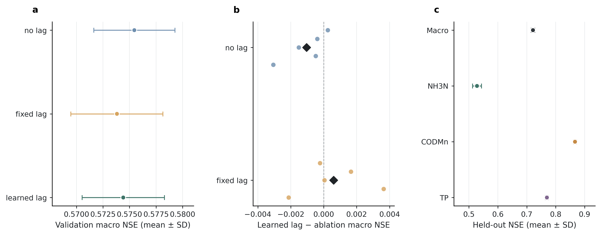

# RiverLagNet real daily multi-seed lag ablation report

## Technical summary

This report is generated from validation-selected checkpoints trained on real-source daily China observations. Imputed values are excluded by masks; the five-seed comparison quantifies training variability but is not a formal significance test.

## Result visualization

## Scope and evidence

- Seeds: 42, 43, 44, 45, 46
- Training commit: `e9623e1b95d158ac8f48780c9c858ea3c55cb3f3`
- Successful jobs: 15
- Selection metric: validation macro NSE
- Shared budget: maximum 50 epochs with patience-8 early stopping

## Condition-level validation results

| Condition | Runs | Macro NSE mean ± SD | MAE mean ± SD | RMSE mean ± SD | Duration mean (s) | Peak VRAM mean (GiB) |
|---|---:|---:|---:|---:|---:|---:|
| no_lag | 5 | 0.5755 ± 0.0038 | 0.2117 ± 0.0041 | 0.4916 ± 0.0021 | 97.78 | 0.9981 |
| fixed_lag | 5 | 0.5738 ± 0.0043 | 0.2121 ± 0.0041 | 0.4915 ± 0.0044 | 93.21 | 1.0419 |
| learned_lag | 5 | 0.5744 ± 0.0039 | 0.2090 ± 0.0067 | 0.4900 ± 0.0068 | 95.34 | 1.0422 |

## Paired RiverLagNet mechanism deltas

Positive values favor the full directed learned-lag model over the named ablation on the same seed.

| Ablation | Mean learned-minus-ablation macro NSE | Paired SD | Full-model wins | Directionally supported |
|---|---:|---:|---:|---|
| no_lag | -0.0010 | 0.0013 | 1/5 | no |
| fixed_lag | 0.0006 | 0.0022 | 3/5 | yes |

## Validation decision

The learned-lag model does not beat `no_lag` under the predeclared rule: its paired mean macro-NSE delta is -0.0010, with wins in 1/5 seeds.

It is directionally above `fixed_lag`, but only by 0.0006 macro NSE with wins in 3/5 seeds. Because `no_lag` is stronger on average and both effect sizes are small, these results do not establish a stable learned propagation-time advantage on this dataset.

## Held-out test results

These metrics summarize only the 5 full learned-lag checkpoints after all validation comparisons were fixed.

| Metric | Runs | Mean ± SD | Min | Max |
|---|---:|---:|---:|---:|
| test_macro_nse | 5 | 0.7215 ± 0.0065 | 0.7116 | 0.7284 |
| test_macro_mae | 5 | 0.1945 ± 0.0059 | 0.1855 | 0.2003 |
| test_macro_rmse | 5 | 0.4289 ± 0.0072 | 0.4176 | 0.4354 |
| test_nse_NH3N | 5 | 0.5280 ± 0.0155 | 0.5097 | 0.5497 |
| test_nse_CODMn | 5 | 0.8668 ± 0.0051 | 0.8612 | 0.8746 |
| test_nse_TP | 5 | 0.7696 ± 0.0056 | 0.7611 | 0.7747 |

## Interpretation boundary

The predeclared engineering rule calls a mechanism directionally supported only when the paired mean delta is positive and the full model wins at least three of five seeds. Test data are excluded from these decisions. Five seeds quantify pipeline variability but do not establish statistical significance.
