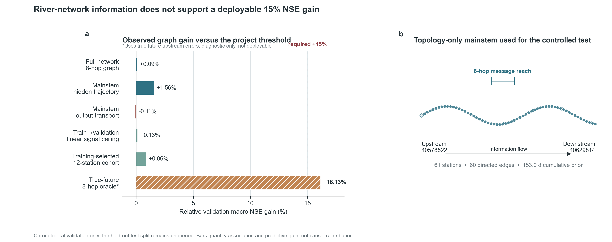

# RiverLagNet 当前核心结果

## 一句话结论

真实日尺度数据表明，有向上游河网信息可以带来正的验证集增益，但当前可部署模型远未达到 15%：全 1068 站任务相对同预算无图模型仅提升 **0.09%**，在不读取水质结果而由拓扑预定义的 61 站连续主干上，最佳 8 跳 RiverLagNet 提升 **1.56%**。

这量化的是河网信息的增量预测价值，不是 attention 的因果效应，也不是污染物真实因果传播量。

## 当前硬门槛核验

| 范围 / 方法 | 无图 macro NSE | 加图 macro NSE | 相对提升 | 结论 |
|---|---:|---:|---:|---|
| 1068 站全网，扩展输入，8 跳轨迹传播 | 0.56350 | 0.56401 | +0.09% | 未达 15% |
| 61 站主干，8 跳隐状态轨迹传播 | 0.58394 | 0.59303 | +1.56% | 当前最佳可部署候选，未达 15% |
| 61 站主干，显式时滞输出输送 | 0.58394 | 0.58331 | −0.11% | 丢弃 |
| 训练期拟合、验证期评价的上游线性诊断 | 0.58394 | 0.58467 | +0.13% | 稳定新增信号很低 |
| 仅按训练期筛选的 12 站队列 | 0.49117 | 0.49541 | +0.86% | 验证期仍未达到门槛 |
| 使用真实未来上游误差的 8 跳 oracle | 0.58394 | 0.67813 | +16.13% | 不可部署，不能作为模型结果 |

15% 门槛在 61 站任务上对应 NSE `0.67153`。只有读取真实未来上游预测误差、并在同一验证结果上拟合和评价的 oracle 超过该门槛；训练期可获得的上游历史与上游本地预测不能复现这一增益。

## 上下游影响的量化边界

- 全网包含 1068 个节点和 1067 条上游→下游边，其中 572 个水头节点没有入边，动态上游消息不可能直接改善这些节点。
- 为排除水头节点稀释，项目按累计旅行时间先验最长路径构建了 61 站、60 边连续主干；选择规则不读取水质值、验证结果或测试结果。
- 主干累计传播时间先验为 153.0 天；8 跳消息传播已经覆盖理论 oracle 首次超过 15% 所需的深度。
- 可部署的训练→验证上游线性诊断最高仅提升 0.13%；按训练期内部留出筛选强关系站后，正式验证提升仍只有 0.86%。这说明训练期上游关系跨期不稳定，而不是单纯模型容量不足。
- 旧 238 节点五种子实验仍证明正确河网方向可产生一致正增益，但平均绝对 ΔNSE 只有 `+0.001337`；该结果支持“存在小幅稳定价值”，不支持“至少 15%”。

## 当前项目判断

继续只调整网络层、隐藏维度或学习率，不能诚实保证 15% 提升。当前数据已经包含本站水质、气象、土壤水和 `dis24`，本站 90 天历史吸收了大部分可预测信息；静态拓扑和近似旅行时间缺少足够的新增、跨期稳定输送信号。

若 15% 仍为硬门槛，项目下一步应优先补充逐河段流量/流速、动态旅行时间、闸坝调度、排污或突发事件、支流汇入负荷等输送过程数据，再重做同预算无图对照。否则正式目标应调整为：

> 量化真实河网信息对 NH3N、CODMn、TP 日尺度预测的增量、适用节点和预测提前期，并如实报告其稳定性与上限。

当前没有启动五种子确认，因为种子 42 的验证筛选未通过 15% 门槛；保留测试集仍未启封。

## 可复现产物

- 完整诊断：[graph_15pct_diagnostic_2026-07-14.md](graph_15pct_diagnostic_2026-07-14.md)
- 审计数值：`experiments/graph_15pct_diagnostic.json`
- 正式图：`docs/figures/graph_15pct_diagnostic_v1.png` / `.pdf`
- 绘图入口：`python -m RiverLagNet.analysis.plot_graph_15pct_diagnostic`
- 原始实验账本：`experiments/results.tsv`
