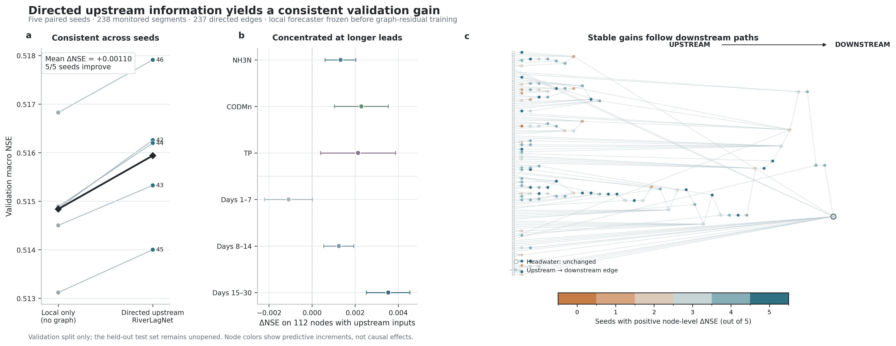

# RiverLagNet 当前核心结果

## 一句话结论

在 238 个监测河段、237 条上游→下游有向边的真实日尺度收缩河网上，冻结局部预测器后仅训练上游河网残差，使验证集 macro NSE 在 5 个配对种子上平均提升 **0.001101 ± 0.000255**，且 **5/5 个种子均为正增益**；在真正能够接收上游信息的 112 个节点上，平均提升扩大到 **0.001914 ± 0.000457**。

这量化的是“使用正确有向上游河网信息的增量预测价值”，不是 attention 的因果效应，也不是污染物真实因果传播量。



## 可归因实验设计

- 数据：`china-real-daily-contracted-v0.2`，3972 天、238 个节点、237 条有向边。
- 任务：过去 90 天预测未来 30 天的 `NH3N`、`CODMn`、`TP`。
- 对照：同一种子的严格 `no_graph` 局部模型。
- 处理：从该种子的验证最优 `no_graph` checkpoint 出发，冻结输入编码器、GRU 和局部解码器；上游输出头零初始化，仅训练消息传递、融合门和上游残差头。
- 节点保护：126 个无上游输入的头水节点预测保持完全一致；五种子最大绝对预测差为 `0.0`。
- 选择边界：所有模型选择和本页结果只使用验证集，保留测试集尚未启封。

因此，配对差异不能由重新训练局部骨干、改变头水节点预测或不同的数据划分解释。

## 五种子量化结果

| 指标（有向河网 − 无图） | 平均值 | 种子间 SD | 范围 | 改善种子 |
|---|---:|---:|---:|---:|
| 全网 macro NSE | +0.001101 | 0.000255 | +0.000825 至 +0.001405 | 5/5 |
| 全网 macro MAE | −0.001438 | 0.001018 | −0.002671 至 −0.000243 | 5/5（越低越好） |
| 全网 macro RMSE | −0.001646 | 0.000829 | −0.002748 至 −0.000750 | 5/5（越低越好） |
| 112 个有上游节点 macro NSE | +0.001914 | 0.000457 | — | 5/5 |

全网 NSE 增益被 126 个严格不变的头水节点保守稀释；有上游节点上的增益约为全网增益的 1.74 倍。

## 增益出现在哪里

有上游节点的三目标平均 NSE 增量均为正：

| 目标 | 平均 ΔNSE |
|---|---:|
| NH3N | +0.001321 |
| CODMn | +0.002288 |
| TP | +0.002134 |

按预测提前期分组：

| 提前期 | 平均 Δmacro NSE |
|---|---:|
| 1–7 天 | −0.001089 |
| 8–14 天 | +0.001242 |
| 15–30 天 | +0.003537 |

当前证据表明，上游河网信息的主要价值集中在中长期预测，特别是 15–30 天；短期 1–7 天仍由本站点局部历史占优。这是下一版融合门应按预测提前期约束或正则化的直接依据。

## 当前模型选择与未解决问题

当前验证选择的候选是：

```text
冻结的局部 GRU 预测器
    + 正确方向的当前上游状态
    + 零起点上游残差校正
```

学习时滞尚未成为最佳机制。seed 42 上，严格锚定且最多使用 10% 历史偏移的 learned-lag 版本验证 macro NSE 为 `0.515917`，低于相同起点的 `no_lag` 版本 `0.516258`。因此当前可以主张“正确河网结构带来稳定的小幅验证增益”，不能主张“学习时滞已被真实数据验证”。

下一步在不启封测试集的前提下，应针对短期负增益实现按提前期的上游门控或约束，并要求新机制在预先注册的多种子验证上超过当前冻结候选；架构冻结后，再一次性评估保留测试集。

## 可复现产物

- 分析入口：`python -m RiverLagNet.cli.summarize_graph_gain --device cuda`
- 机器汇总：`experiments/real_contracted_graph_gain_v9_summary.json`
- 节点结果：`experiments/real_contracted_graph_gain_v9_nodes.csv`
- PNG/PDF：`docs/figures/real_contracted_graph_gain_v9.*`
- 原始正式实验账本：`experiments/results.tsv`
