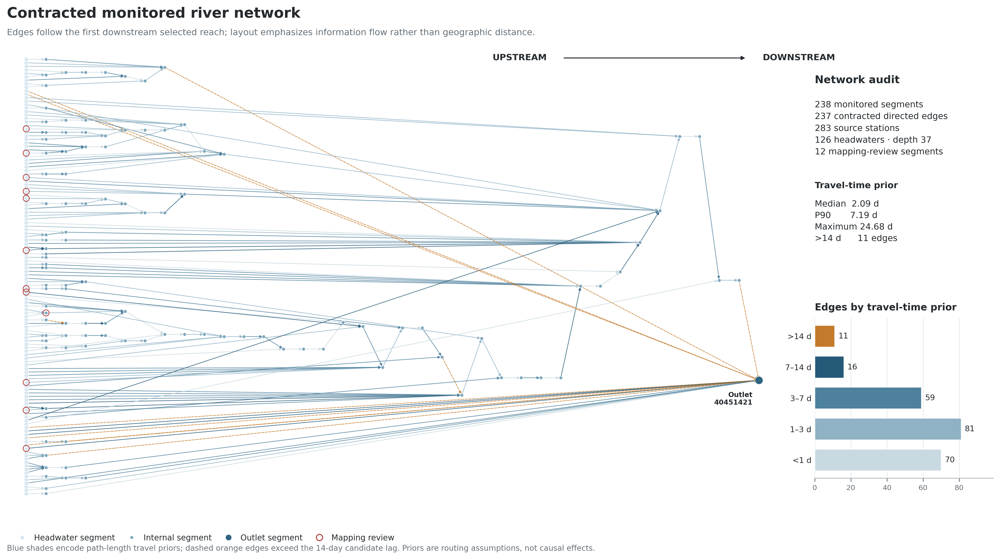
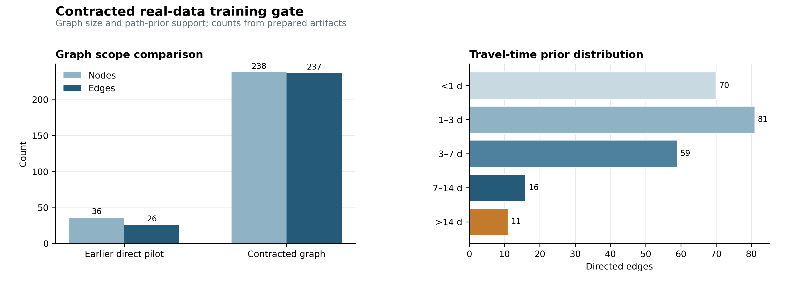
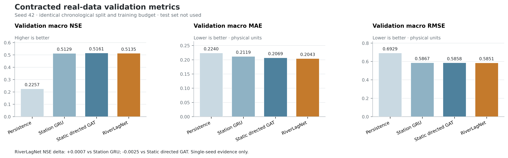

# Contracted China real-daily graph and training audit

## Outcome

The contracted dataset passed the formal-training gate and completed the first four-model seed-42 validation benchmark. It contains 3,972 daily timestamps, 238 monitored HydroRIVERS segments, 237 upstream-to-downstream edges, and 283 mapped source stations. Imputed source values are excluded from masks, normalization, loss, and metrics; every selected segment has 100% original-observation coverage for NH3N, CODMn, and TP.

The single-seed benchmark does not yet support a learned-lag advantage. RiverLagNet validation macro NSE was 0.5135, only 0.0007 above Station GRU and 0.0025 below Static Directed GAT. The test split was not used.

## The 26-edge artifact is removed

The earlier graph retained only direct monitored-reach neighbours. The new builder follows HydroRIVERS `NEXT_DOWN` through unmonitored reaches and connects each selected reach to its first selected downstream reach. It accumulates path length and hop count while preserving upstream-to-downstream direction.

- All mapped reaches: 3,397 nodes, 2,986 contracted edges, 411 weak components.
- After the 90% three-target coverage gate: 2,998 nodes, 2,623 edges, 375 components.
- Largest coverage-passing component: 1,068 nodes, excluded by the 256-node pilot compute cap.
- Selected largest eligible component: 238 nodes, 237 edges, one directed tree.
- Contracted path length: median 62.63 km, 90th percentile 215.74 km, maximum 740.38 km.
- Travel-time prior: median 2.09 days, 90th percentile 7.19 days, maximum 24.68 days.



The layout is topological rather than geographic: upstream sources are on the left and the single downstream outlet is on the right. Blue shades encode travel-prior ranges. The 11 orange dashed edges exceed the current 14-day candidate-lag support.

## Data gate



The gate checks direction, acyclicity, the tree identity `E = N - C`, minimum original-observation coverage, contiguous dates, sufficient 90-to-30 history, and exclusion of imputed source values. The executable [audit notebook](../../notebooks/contracted_graph_data_gate.ipynb) ran from top to bottom and asserts every gate condition.

Machine-readable evidence is retained in the [graph summary](../../experiments/china_real_daily_contracted_graph_summary.json). The prepared NPZ, Parquet files, graph fixtures, source hashes, and complete manifest remain under the Git-ignored `data/processed/china-real-daily-contracted-v0.2/` directory.

## First formal validation benchmark

All four models used seed 42, the same chronological 70/15/15 split, 90-day input, 30-day direct forecast, formal GPU budget, early stopping rule, and metric implementation.

| Model | Validation macro NSE | Macro MAE | Macro RMSE | Duration (s) | Peak VRAM (GiB) |
|---|---:|---:|---:|---:|---:|
| Persistence | 0.2257 | 0.2240 | 0.6929 | 27.8 | 0.48 |
| Station GRU | 0.5129 | 0.2119 | 0.5867 | 61.4 | 1.69 |
| Static Directed GAT | **0.5161** | 0.2069 | 0.5858 | 267.7 | 1.69 |
| RiverLagNet | 0.5135 | **0.2043** | **0.5851** | 681.8 | 4.05 |



The machine-readable [training summary](../../experiments/china_real_daily_contracted_seed42_summary.json) is generated from the append-only experiment ledger. Static Directed GAT is descriptively best by validation macro NSE, while RiverLagNet has slightly lower aggregate errors. These differences are too small for a single-seed mechanism claim.

## Limitations

- The 256-node cap is a pilot compute rule, not a hydrological boundary or national representativeness claim.
- Twelve selected reaches retain a mapping-review flag and require an exclusion sensitivity.
- Travel time uses an assumed 30 km/day speed, not observed tracer or discharge-calibrated travel time.
- Eleven edge priors exceed `max_lag=14`; the first benchmark keeps the declared v0.1 lag window for comparability.
- Attention weights are routing weights and must not be interpreted as causal contributions.
- No held-out test result is reported because model and lag comparisons are not yet frozen across seeds.

## Next controlled experiment

Run the resumable paired five-seed `no_lag`, `fixed_lag`, and `learned_lag` suite:

```powershell
conda run -n DeepWater python -m RiverLagNet.cli.run_experiment_suite --suite real_contracted_lag_v2
conda run -n DeepWater python -m RiverLagNet.cli.run_experiment_suite --suite real_contracted_lag_v2 --summarize
```

Only after validation comparisons are frozen should the selected learned-lag checkpoints be evaluated once on the held-out test split. Follow-up sensitivities should compare `max_lag=14` with 28 days and exclude mapping-review reaches.
