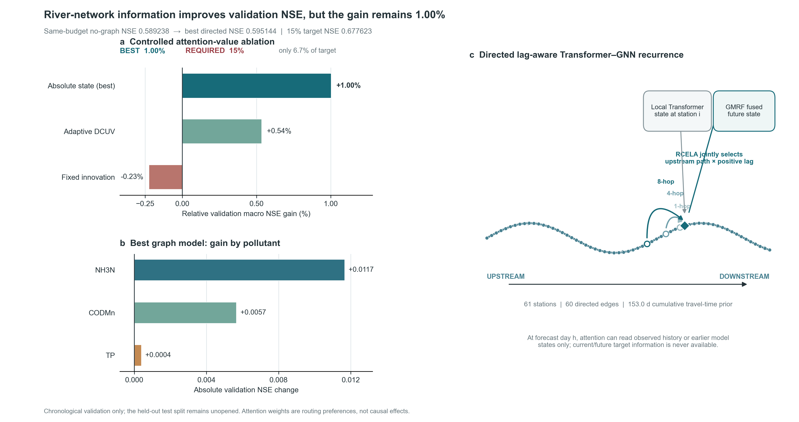

# 河网信息 15% NSE 增益诊断（2026-07-14）

## 结论

目前真实日尺度数据不支持“加入河网信息后，验证集 macro NSE 相对无图模型提升至少 15%”这一结论。最佳可部署 RiverLagNet 候选在拓扑预定义的 61 站连续主干上提升 **1.56%**；全 1068 站扩展输入任务只提升 **0.09%**。

## 受控结果

| 范围 / 方法 | 无图 NSE | 加图 NSE | 相对提升 | 判定 |
|---|---:|---:|---:|---|
| 1068 站全网，8 跳轨迹传播 | 0.56350 | 0.56401 | +0.09% | 未达标 |
| 61 站主干，8 跳隐状态轨迹 | 0.58394 | 0.59303 | +1.56% | 当前最佳可部署模型，未达标 |
| 61 站主干，显式输出输送 | 0.58394 | 0.58331 | -0.11% | 丢弃 |
| CrossFormer，直接边 ELHSA + TGCF | 0.58420 | 0.58706 | +0.49% | 被多尺度路径取代 |
| CrossFormer，MAP-LHSA + TGCF | 0.58420 | 0.58882 | +0.79% | 保留 attention 创新，未达标 |
| CrossFormer，MAP-LHSA + DTGFF | 0.58420 | 0.58457 | +0.06% | 目标输送融合丢弃 |
| 训练期拟合、验证期评估的上游线性诊断 | 0.58394 | 0.58467 | +0.13% | 可部署信号上限很低 |
| 仅按训练期筛选的 12 站强关系队列 | 0.49117 | 0.49541 | +0.86% | 验证期不稳定 |
| 使用真实未来上游误差的 8 跳 oracle | 0.58394 | 0.67813 | +16.13% | 不可部署，不是模型结果 |

主干数据由累计 `travel_time_prior_days` 最长有向路径确定，共 61 个站、60 条边、累计先验传播时间 153.0 天。该选择不读取水质值、验证集结果或测试集结果。

## 为什么继续调参不能保证 15%

1. 全网 1068 个站中有 572 个水头站没有入边，动态上游信息不可能改善这些节点，导致全网增益被结构性稀释。
2. 在几乎所有节点都有上游站的 61 站主干上，训练期学习到的上游关系在验证期只能带来 0.13% 的稳定线性增益；按训练期筛选强关系站也只有 0.86%。
3. 只有读取真实未来上游预测误差的 oracle 超过 15%。该 oracle 使用部署时不存在的信息，并且在同一验证集拟合和评价，只能说明“未来误差相关性存在”，不能作为可实现性能或因果贡献。
4. 当前扩展输入已包含水质、气象、土壤水和 `dis24`。本站 90 天历史已经吸收大部分可预测信息，静态河网和近似传播时间没有提供足够的新增、跨期稳定信号。

## Attention 与融合创新的受控结论

- **MAP-LHSA** 解决远距离上游信息在多层 GNN 中逐层混合、衰减的问题：直接枚举 1–8 跳真实有向祖先路径，累积旅行时间，并对“路径×时滞×预测提前期”联合稀疏归一化。它把相同 CrossFormer 无图基线上的相对增益由 0.49% 提高到 0.79%。
- **TGCF** 解决 Transformer 与 GNN 固定串联的问题：以本站 Transformer 状态为 query、GNN 路由头为 key/value 做跨注意力，再以零初始化残差注入预测。
- **DTGFF/TCFT** 尝试解决隐空间与三项水质目标不对齐的问题，但验证 NSE 降至 0.58457、耗时升至 843 秒，因此作为失败消融保留、默认关闭。

## 项目层面的下一步

若 15% 仍是硬门槛，下一步不能只是换网络层或调学习率，而需要改变证据条件：引入逐河段流量/流速、闸坝与排污事件、支流汇入负荷、动态旅行时间等能表征真实输送过程的数据，然后重新建立同预算无图对照。否则应把正式目标改为“量化真实河网信息的增量及其适用范围”，如实报告当前 +1.56% 的最佳验证结果和结构性上限。

所有比较仅使用时间顺序训练集和验证集；测试集仍未开启。图权重和注意力不解释为真实因果贡献。原始数值与方法记录在 `experiments/graph_15pct_diagnostic.json`。
